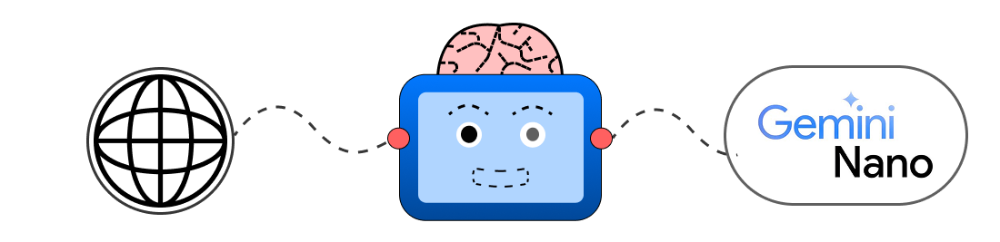

  

<h1 align="center">NanoSum</h1>

  <strong>Your smart-browse assistant that summarizes, translates, and analyzes any webpage using 100% on-device AI.</strong>
    
  <i>Submission for the Google Chrome Built-in AI Challenge 2025.</i>

  

---

## 🚀 Demo

  <strong>Watch the 2-minute demo video: [Click Here for Demo](https://www.youtube.com/watch?v=eMdTws5NV3Y)</strong>

---

## 🧐 What is NanoSum?

NanoSum is a Chrome Side Panel assistant built to solve **information overload** and **time panic**. For students and professionals who are overwhelmed by long articles before a test or a meeting, NanoSum provides a suite of on-device AI tools to learn or revise any topic in minutes.

Because it uses the on-device **Gemini Nano** model, your data and browsing history **never leave your browser**, ensuring 100% privacy.

## ✨ Features

NanoSum is a complete AI suite that uses all six of the core text-based, built-in AI APIs:

* 📜 **Summarizer API:** Instantly generates a clean paragraph summary and a formatted list of key points.
* 🌐 **Translator API:** Automatically translates any generated text into 7 different languages.
* 🖌️ **Rewriter API:** Rewrites the entire article's content to be simpler, more formal, or casual (e.g., "in less than 200 words").
* ✨ **Writer API:** Creatively generates new content (like a poem or song) based on the page's topic.
* ✔️ **Proofreader API:** *Automatically* proofreads your prompts *before* sending them to the AI, ensuring better results.
* 💬 **Prompt API (LanguageModel):** Answers in-depth, specific questions about the *full text* of the article.
* 📥 **Export:** Saves any AI-generated text to a `.txt` file for your notes.

---

## 🛠️ Built With

* **Google Chrome Built-in AI APIs:**
    * `Summarizer`
    * `Translator`
    * `Rewriter`
    * `Writer`
    * `Proofreader`
    * `LanguageModel (Prompt API)`
* **Chrome Extension Platform:** Manifest V3, Side Panel API
* **Core Tech:** JavaScript (ES6+), HTML5, CSS3

---

## 🔧 How to Install (for Hackathon Judging)

This extension uses experimental APIs and requires Chrome Canary.

### 1. Prerequisites
* **Google Chrome Canary** (Version 142+).
* **Enable AI Flags:** Go to `chrome://flags` and **Enable** the following two flags:
    * `#prompt-api-for-gemini-nano`
    * `#optimization-guide-on-device-model`
* **Download the Model:** After enabling the flags, go to `chrome://components`, find **"Optimization Guide On Device Model"**, and click **"Check for update"**. Restart your browser.

### 2. Installation
1.  Download this repository as a `.zip` file and unzip it.
2.  Open Chrome Canary and go to `chrome://extensions`.
3.  Turn on **"Developer mode"** in the top-right corner.
4.  Click **"Load unpacked"** and select the unzipped project folder.
5.  Pin the **NanoSum icon** to your toolbar.

---

## 💡 How to Use

1.  Navigate to any webpage (e.g., a Wikipedia article).
2.  Click the NanoSum icon in your toolbar to open the side panel.
3.  Click **"Summarize & Analyze"** to get a summary and key points.
4.  Use the **"Translate to:"** dropdown to auto-translate the result.
5.  Use the **"Advanced Actions"** to:
    * **Rewrite** the content in a different style.
    * **Proofread** the original content.
    * **Run Writer** with a creative prompt (e.g., "write a poem").
    * **Ask Prompt** with a specific question (e.g., "What is Alan Turing's role?").
